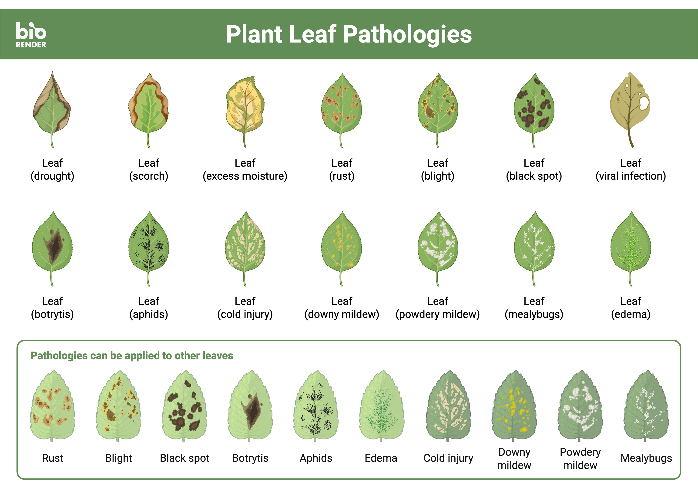
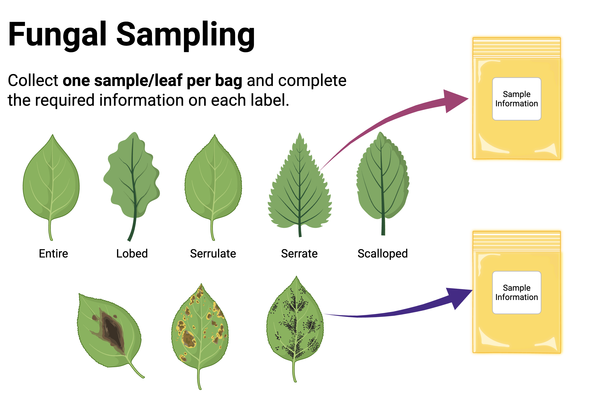

# Module 1: Fungal Sampling {.unnumbered}

## Module 1.1 – Lab Prep Overview

### Instructor Laboratory Preparation Instructions

**Materials:**

- [ ] Cellophane discs (rinsed and individually wrapped before autoclaving)
- [ ] 150x10mm Petri dishes
- [ ] 60x15mm Petri dishes
- [ ] Bacteriological agar
- [ ] Forceps
- [ ] Scalpels or metal hole punch

**Lab Prep and Sterility:**
We will be working at the bench and without Bunsen burners. **Be very careful and do not leave plates open for long periods.** First, clean your work area with bleach, and/or ethanol. We will use clean benches and laminar flow hoods when available, but this is a good alternative for those without access to these resources.

::: {.callout-warning}
Note that we will be working with fungi, which are generally not harmful to humans, but can cause allergic reactions in some individuals. Always practice good sterile technique and handle all materials with care. If you have any concerns about allergies or sensitivities, please consult with your instructor before beginning the lab.

Additionally, we may not be able to work in a laminar flow hood, which increases the risk of contamination. Be extra cautious with sterile technique and be prepared for some contamination in your plates. **Work carefully and do not leave plates open for long periods of time.**
:::

**Water Agar Plates:**
Student scholars isolate fungal endophytes from leaves on water agar. We use one 100x15mm Petri dish to plate up to 6 leaf discs.

**Water Agar Recipe:**
Suspend 39 grams bacteriological agar in 1000 mL (1 L) distilled water. Heat to boiling to dissolve the medium completely (in most cases, this step can be skipped as autoclaving will dissolve media). Sterilize by autoclaving at 15 lbs pressure at 121 °C for 15 minutes.

When the media is cool enough to handle with autoclave gloves, pour 100x15mm plates in a sterile environment. Do not let it cool too long as the media will solidify. Each 100x15mm plate holds approximately 20 ml media. If plates will be used immediately smaller amounts of media can be poured into plates. If plates will be stored, use larger amounts. Store plates in the original dish sleeve in a refrigerator (~4 °C) until use.

**Disposal:**
Place all Petri dishes in an autoclavable bag and sterilize at 15 lbs. pressure at 121 °C for 15 minutes. Follow institutional protocol for post-sterilization disposal. Be sure that the disposal of any heavy metals or other chemicals is properly handled.

## Module 1.2 – Metadata Directions

### Metadata
**Metadata** is the data providing information about other data. 
In this project, metadata refers to information related to the fungi you will study, including information about the substrate (e.g., plant host for fungal endophytes), location (latitude and longitude), elevation, images, fungal species, growth rates, assay information, images, and other variables. This document guides you through capturing this data and where to document it.

Once you have selected the plant(s) that you will isolate fungi from, upload an image of each plant to your course's iNaturalist Project page. This part of the larger MycoEd Fungal Genomics Education Project. The fungi you isolate from this plant and the data associated with the fungal isolates will be linked back to this observation. These data will then be freely available to you and any other researchers interested in investigating fungal endophyte ecology and genomics.

Record metadata on the **Endophyte spreadsheet**. Below are descriptions for each category where necessary.

### iNaturalist plant observation:
[NC State Myco Ed on iNaturalist](https://www.inaturalist.org/projects/nc-state-myco-ed)

### Sample Naming:
Your individual fungal isolates will be identified using several identifiers. The first will be the unique **Host ID number** that identifies the host for the fungi you isolate. Second will be **your initials**. Please use at least 3 initials since some large courses may have students with shared initials. Third, **each individual leaf you cultured fungi from will be a separate number**. If you take multiple samples from the same leaf, they will be identified by letters. For example, if you have one leaf or needle with 3 different sections, they would be 1a, 1b, and 1c.

**Example:** You have leaves collected from a maple tree on your campus. This tree was logged in iNaturalist and given a unique field number MycoED_004 (or whatever format the field numbers are provided in by your instructor/TA) (See the next module 1.2 for details). Let's assume your initials are ABC. From this collection, you have three leaves that you culture from: leaf 1, leaf 2, and leaf 3. From each of these leaves, you take six segments, so these are letters a-f. So, if you isolate a fungus from the second leaf, third section, and your initials are ABC, the name of the isolate would look like MycoED_004_ABC_2c.

With this naming scheme, anyone can trace the 1) plant host, 2) the researcher, 3) and the leaf and section the fungal isolate came from. NO other fungus will have this precise labeling unless additional fungi were isolated from this leaf section. After that step you will need to add additional identifiers.

### Sample location:
Record latitude and longitude in decimal format.
On a computer, go to iNaturalist observation. On the map, click on details at the bottom.

From the dropdown menu. The Lat/Long is now shown. Click the copy button and paste it into the Excel Spreadsheet.

You can also find Lat/Long coordinates on Google Maps.
For Android phones: tap location and copy and paste in a text and it’s automatically in decimal degree format.
For the iPhones:
1. Open the Google maps app. Tap the "black triangle in a circle" icon to zoom to your location.
2. Long touch on your location. This should open a tab at the bottom of the screen.
3. Scroll up. You should see the latitude and longitude coordinates of that position, looking something like this: (45.1234567, -122.1234567).
4. Long touch the coordinates, tap copy and then paste into an email or text.

### Elevation:
Record the elevation of the plant in meters.
On a computer, go to iNaturalist observation and again, click on details at the bottom.
1. On a computer, go to iNaturalist observation and again, click on details at the bottom.
2. At the bottom of the details window, click macrostrat.
3. The next window will display elevation in meters in the upper right. Record this elevation.

### Canopy:
Record the portion of the canopy where the leaf was collected (L-lower 1/3 of plant, M-middle 1/3 of plant, or U-upper 1/3 of plant).

## Module 1.3 - Fungal Sampling and Culturing

### Purpose
This lab will introduce you to sterile/aseptic technique, culturing fungi, isolating cultures, and documenting fungal growth.

### Introduction
Every species of plant surveyed to date hosts a multitude of fungal **endophytes**. These symbiotic fungi exist in all plant tissues, including leaves, bark, roots, and reproductive structures such as flowers and seeds. Observation of leaves can provide information on potential plant disesase, including fungal infections. This is illustrated in @fig-leafpathologies, which depicts a variety of leaf pathologies. Fungal endophytes can be cultured from healthy plant tissue, and these fungi can be important for plant health and fitness. These fungi can be mutualistic, commensal, or parasitic. They can also be latent pathogens that cause disease under certain conditions.

All lineages of fungi contain endophytic species, however the majority of fungal endophytes described to date are Ascomycetes. Research has shown that fungal endophytes impact both plant species fitness and plant community fitness. Fungal endophytes can confer abiotic and biotic stress tolerance, influence biomass and water consumption, and alter resource allocation. The fungi live either between the plant cells, between the cell wall and the cell membrane, or sometimes even within the cell membrane. This project is part of the MycoEd Fungal Genomics Education Project. **The goal of this long-term research project is to produce fungal reference genomes to better understand their biology.**

{#fig-leafpathologies fig-alt="Plant Leaf Pathologies." fig-align="center" lightbox="true"}

### Learning Goals
1. Documentation using iNaturalist
2. Practice sterile technique
3. Culture and isolate fungi
4. Investigate fungal endophytes
5. Characterize morphology of fungal cultures

### Lab Supplies
- [ ] 3 large water agar Petri plates (150 x 10 mm) - these are for initial isolation
- [ ] Sharpie
- [ ] Parafilm
- [ ] Paper towels
- [ ] Gloves
- [ ] Bleach
- [ ] Ethanol
- [ ] Scalpel
- [ ] Metal hole punch
- [ ] Forceps

### Instructions
#### Isolation of Fungi from Leaves
Before you begin, read through the entire instructions. Be sure to consult your instructor if you have any questions.

**Formulate your Research Question**
You will attempt to culture fungi from a total of 18 leaf sections. You may use any combination of plant species, individual plants, leaf portions, or leaf cuttings in your setup. Choose a combination that interests you. Are you interested in capturing the diversity within an individual plant? If so, are you interested in looking at the diversity of endophytes within the canopy of individual plants? For this question, you would plate leaves from lower, middle, and upper canopies. Are you interested in documenting the fungal endophyte diversity within a plant species? For this investigation, collect leaves from multiple individuals of the same species. Perhaps you want to compare species diversity between different plant species. To investigate this question, collect plant leaves from a variety of plant species.

**Design your Experimental Setup**
Once you have decided what endophyte communities you would like to explore, obtain green leaves from your target host plants. These can be from deciduous or evergreen plants, including needles from conifers. You should plate your leaves within 24 hours of collection. Refrigerate your leaves if you need to store them between collection and plating.

**Metadata**
Upload an image of the plants you have chosen to your course's iNaturalist Project page. Follow the instructions in Module 1.1 - Metadata Directions to be sure you have documented all necessary metadata.

**Sampling Endophytes**

Materials needed:

- [ ] Your phone with iNaturalist.
- [ ] Sample labels with unique ID numbers.
- [ ] Paper bags for samples.
- [ ] Clippers, scissors, or a knife to sample leaves.

**Protocol:**
1. Find a tree, or other plant to sample. Ideally, one that has healthy leaves.
2. Make an iNaturalist observation of the plant on your phone or device.
   a. Take multiple photos.
      i. At least one of the entire plant.
      ii. Multiple closer pictures of the leaves, bark, any flowers or fruit, etc.
      iii. At least one observation must include one sample label with an ID number.
   b. Go to the projects section on iNaturalist.
      i. Select "Your iNaturalist Project".
   c. Save the observation on iNaturalist.
      i. Follow instructions in Module 1.2 Using iNaturalist
3. As indicated in @fig-leafsampling, place the label in a paper bag. Record your information on the label including the unique ID number, date, location, and any other relevant information. This will be important for tracking your samples and linking them to your iNaturalist observation.
4. Sample up to three leaves using your cutting instrument.
5. Put the leaf samples into the bag.

{#fig-leafsampling fig-alt="Fungal Sampling. Collect one sample/leaf per bag and complete the required information on each label." fig-align="center" lightbox="Leaf sampling"}

**Culturing Fungi From Leaves**
You have 3 larger (150x10mm) Petri dishes that contain water agar. Water agar media is more clear (whitish to translucent) than the smaller Petri dishes which contain Potato Dextrose Agar (PDA). These water agar plates will be used for Part I of this exercise. Section each of these into 6 regions as depicted in Figure 1. This will provide you space to culture 18 leaf sections.

Gather all supplies including sterilized water, 70% ethanol, and 10% bleach solution. Label the Petri dishes and read through procedures before starting. Place bleach solution and sterile water in a container with enough space to dip leaf tissue. Use the provided scalpel or metal paper hole punch from your lab kit to take leaf subsamples.

1. Sanitize/sterilize all work surfaces. Wipe surfaces with ethanol. Choose a working location with the least amount of airflow to prevent contamination. If available, set up torches on either side of your work area with the flames aimed toward the middle of your workspace. The heat generated from the torches creates an the potential of airborne contaminants.
2. Sterilize tools (scalpel or hole punch and forceps)
   a. Heat your tool using a flame (candle, alcohol lamp, torch, or something similar).
   b. Let cool – you can dip the tool (scalpel or hole punch) into the bleach solution to cool.
3. Cut leaf tissues. You may take as many cuttings from each leaf as desired. Be sure to label cuttings appropriately as described above. Cuttings should be ~1 cm.
4. Surface sterilize leaf tissue. Using sterilized forceps (heat and cool as above), immerse each cutting in 10% bleach solution for 10 seconds.
   a. To prepare the bleach solution, sterilize water by boiling water for 10 minutes. You will need enough water for the bleach solution and rinse step. Distilled water is preferred. If unavailable, use tap water. Let water cool to room temperature before coming into contact with plant tissue.
   b. Mix 1ml (1/4 teaspoon) household bleach with 500 ml (2 cups) sterilized water.
5. Rinse leaf tissue. Transfer leaf cutting from bleach solution using forceps and swirl in sterile water or 70% ethanol to rinse. Let excess water drip off leaf cutting or place on clean kimwipes to dry.
6. Add tissue to water agar. Place up to 6 leaf cuttings per plate of water agar labeled as described above (Figure 1). The water agar plates are the larger plates that contain clear to whitish media. Use sterile technique. Be sure to sterilize forceps (heat with flame and cool) in between each leaf transfer.
7. Seal Petri dish with Parafilm. This is a stretchy material similar to Saran Wrap. Cut a strip a little wider than the Petri dish. Remove the paper backing. Hold one end of the Parafilm strip on the lip of the Petri dish so that the gap between the lid and base is covered by the Parafilm. Keeping one end fixed with one hand, stretch and wrap the parafilm around the Petri dish, sealing the gap between the lid and base of the Petri dish. The stretching of the Parafilm will facilitate the seal, you will not need any tape to keep the Parafilm in place.
8. Incubate at room temperature in the dark and examine for growth each day.

## Module 1.4 – Using iNaturalist

### Using iNaturalist
For this semester we will be sampling plant tissue and isolating endophytic fungi for an experiment in fungal genomics. Part of this research will include the collection of important meta-data which includes latitude and longitude information, sampled material/host, and taxonomic information. To facilitate this we are using iNaturalist.

**Homework Assignment 1: Get set up to use iNaturalist.**

- Go to https://www.inaturalist.org/ and make an account if you don't already have one.
- Download the iNaturalist App to your phone.
- Give your iNaturalist user ID to your course instructor or TA. They will need this to add you to the course project. Be sure to ask your instructor for the name of the course project.
- Join your course project. Within your iNaturalist account, go to: Community>Projects Assuming you're invited you should see the name of your course project. Join the project. If you don't see it, send your iNaturalist user ID to your Instructor or TA to receive an invitation.
- Add your Real Name to iNaturalist
  - For your name to display properly you need it spelled out in your profile.
  - Log into iNat.
  - Go to your profile icon in the top right.
  - Select Account Settings.
  - Type your real name into the space under Display Name.
- iNaturalist Application Settings on your phone.
  - Go to settings on your phone.
  - Turn off "Automatic Upload" (recommended).
  - Adjust settings as they suit you.

**Learn how to use iNaturalist to make observations for scientific research.**
iNaturalist makes documenting samples easy through observations. We will use this to help collect the metadata on our specimens in the upcoming lab. To prepare yourself, please review the following resources.

**Homework Assignment 2: Review videos on how to document fungi.**

- [ ] [Getting Started](https://www.inaturalist.org/pages/getting+started)
- [ ] [iNaturalist Videos](https://inaturalist.freshdesk.com/en/support/solutions/folders/151000547795)
- [ ] [NAMA/FunDiS How To Collect Research Specimens](https://youtu.be/EgZw37NjxkA)



- [ ] [FunDiS Photography](https://fundis.org/get-started/photograph)

Our protocol will be specific to our project, but will borrow from any/all of the video guides shown above.

### Making observations for your mycology course (Myco-Ed)
To make the best use of iNaturalist as a tool for this course, and the broader MycoEd Project, you need to make quality observations of plant hosts, and the fungal endophyte cultures that come from these plants.

**Required Ingredients**

**Observations of Plant Hosts**

1. Open your iNaturalist Application.
2. Make an observation of one host plant by taking a picture of it.
   a. Find the camera icon in the app and take a picture of your plant.
   b. Include one field label in an image of the plant. (see examples)
   c. Take images from multiple perspectives: whole plant, leaves, flowers+fruits, branches, trunk, etc.
3. Alternatively, take images on your phone and upload them to iNaturalist. Again, make sure you are including a field label in your images.
4. Before saving the observation, add it to your course project using the app.
   a. Go to "Projects"
   b. Select the course project.
   NOTE: You must join the course project before this step. See the third bullet point at the beginning of these instructions.
5. Click Done to save your observation.
6. Assuming you've turned "automatic upload" off, you will need to manually upload your observation. This will appear green on your phone until it is uploaded.
7. Double-check your observation online.
   a. It will appear on your account if it was uploaded correctly.
8. Add Myco-Ed ID. This will attach the field label ID number to this host observation.
   a. Under Observations Fields, on the lower right portion of the page, type "MycoEd"
   b. Select "MycoEd ID" from the dropdown that appears.
   c. Add the field label ID number assigned to this host in the blank field under MycoEd ID.
   d. Click "Add".

Under Project you should see the name for your course project. If not, click on the open field and the course project's name should appear in the drop-down menu. Select the

**Observations of Fungal Cultures**
Protocols for making observations of fungal cultures that follow the same steps as above with some added metadata that will go in as "Observation Fields".

9. Open your iNaturalist Application.
   a. Alternatively, take images on your phone and upload them to iNaturalist.
10. Make an observation of the fungal isolate by taking a picture of it.
    a. Take pictures from the top and bottom, including the label.
11. Before saving the observation, add it to your course project using the app.
    a. Follow the instructions detailed above.
12. Click Done to save your observation.
13. Manually upload your observation. This will appear green on your phone until it is uploaded.
14. Double-check your observation online.
    a. It will appear on your account if it was uploaded correctly.

**Adding iNaturalist Observation Fields**

15. Add MycoEd ID. This will attach the field label ID number to this host observation.
    a. Follow the above directions.
    b. The format of the MycoEd ID of fungal isolates should be in the form of: MycoEd Host ID_Your Initials_Leaf and Fragment number.
    Example: MycoEd_004_ABC_2c
    See: Myco-Ed Module 1.1 - Metadata, under the Sample Naming section
16. Add other iNaturalist Observation Fields
    a. For ITS sequence data from fungal isolates, use DNA Sequence ITS
    b. To link to the host iNaturalist observation for this fungus, use the Host Observation Observation Field and add the URL to the host observation.