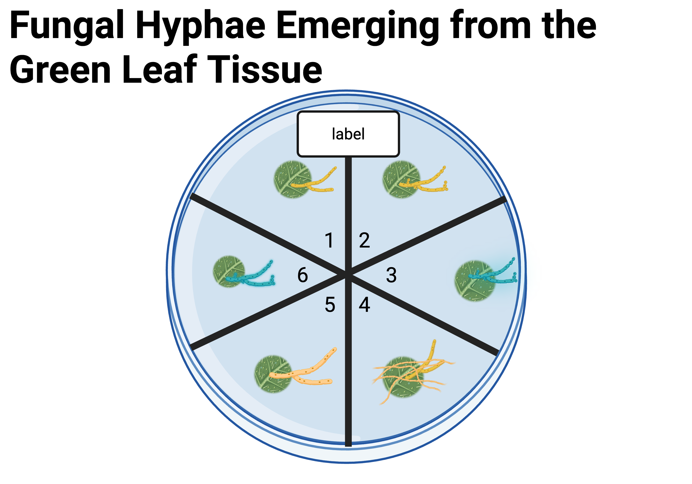

# Module 2: Fungal Isolation {.unnumbered}

::: {.callout-tip}
### 📽️ Open Slides
[Open Module 2 Slides](module2-slides.html)
:::

## Module 2.1 – Lab Prep Overview

### Instructor Laboratory Preparation Instructions

#### Materials

- [ ] Cellophane (rinsed, individually wrapped in gauze, and autoclaved)
- [ ] 100x15mm Petri dishes
- [ ] 60x15mm Petri dishes
- [ ] Bacteriological agar
- [ ] Potato Dextrose Agar (PDA)
- [ ] Forceps
- [ ] Scalpel

**Lab Prep:**

::: {.callout-important}
Read all directions and gather all supplies before beginning. Carefully clean your work area with bleach, and/or ethanol.
:::

**Potato Dextrose Agar (PDA) Plates:**
Fungi cultured from leaves on water agar is transferred to nutrient Potato Dextrose Agar (PDA) plates. **We use one 60x15 mm Petri dish for each fungal isolate.**

**Potato Dextrose Agar Recipe:**
Suspend 39 grams Agar, Bacteriological in 1000 ml (1 L) distilled water. Heat to boiling to dissolve the medium completely (in most cases, this step can be skipped as autoclaving will dissolve media). Sterilize by autoclaving at 15 lbs pressure (121°C) for 15 minutes.

When the media is cool enough to handle with autoclave gloves, pour 60x15mm plates in a sterile environment. Do not let it cool too long as the media will solidify. Each 60x15mm plate holds approximately 8 ml media. If plates will be used immediately smaller amounts of media can be poured into plates. If plates will be stored, use larger amounts. Store plates in the original Petri dish sleeve in the refrigerator (~4 °C) until use.

::: {.callout-note}
**Option: Adding Antibiotics:**
Once your PDA has cooled, you may choose to add antibiotics to the media. Streptomycin (streptomycin sulfate) is commonly used at a concentration of 50mg/L in agar. Add the appropriate amount to your media once cool to the touch and before pouring plates.
:::

**Cellophane Plates:**
Fungal tissue can be harvested from cellophane plates. Cut cellophane discs slightly smaller than the petri dish so that they lay flat on the PDA media. Using the bottom of the petri dish as a template, draw a circle on the cellophane and cut out discs on the inside of the line.

Place cellophane discs into an autoclavable container with water. Place each cellophane disc individually into the water and try to stagger them in the water. This staggering step ensures that you can more easily remove the discs from the water. Cover your container with foil and sterilize by autoclaving at 15 lbs. pressure at 121 °C for 15 minutes.

Working in your sterile environment, place one cellophane disc onto cooled PDA agar in 60x15mm plates. Use sterile forceps to transfer each cellophane disc onto the PDA plate. If you can't easily remove single discs, try the "slide" technique. Dip your forceps into the container with the discs until you touch a disc. Using the forceps as a probe (not pinched) slide the disc to the side of the container and up the side of the container. Often, you'll pull out one disc. Sometimes more than one disc will slide up, but it's usually easy to see the individual discs at this point. You can then use your forceps to pull out one disc. If you grasp one disc with your forceps, you can swirl it in the water in the container to dislodge any other discs that might be attached. Open the lid of the petri dish and lay the cellophane onto the solid agar.

**Disposal:**
Place all Petri dishes in an autoclavable bag and sterilize at 15 lbs pressure (121°C) for 15 minutes. Follow institutional protocol for post-sterilization disposal. Be sure that the disposal of any heavy metals or other chemicals are properly handled.

::: {.callout-important}
Please use the red biohazard bags for disposal of all Petri dishes and materials that have come into contact with fungi. This includes gloves, paper towels, Kimwipes, and any other materials used during the lab. Do not dispose of these materials in regular trash or recycling bins.
:::

## Module 2.2 - Fungal Isolation

### Purpose
This lab will introduce you to sterile technique, culturing fungi, isolating cultures, and documenting fungal growth.

::: {.callout-warning}
Note that we will be working with fungi, which are generally not harmful to humans, but can cause allergic reactions in some individuals. Always practice good sterile technique and handle all materials with care. If you have any concerns about allergies or sensitivities, please consult with your instructor before beginning the lab.

Additionally, we may not be able to work in a laminar flow hood, which increases the risk of contamination. Be extra cautious with sterile technique and be prepared for some contamination in your plates. If you have access to a laminar flow hood, please use it for this lab.
:::

### Introduction
In the previous lab, we started the process of sampling fungal endophytes. We documented the host plant using iNaturalist and then sampled foliar tissues from the plants. These foliar tissues were transported to the lab, surface sterilized to remove any external contaminants, and dissected. The dissected tissues were plated onto water agar plates, sealed, and labeled.

Today, we will isolate, or subculture, these fungi onto PDA agar (Potato Dextrose Agar). This nutrient agar will allow for fungal growth. We will then measure the growth rate of each individual fungal isolate.

This project is part of the [Myco-Ed Fungal Genomics Education Project](https://mycocosm.jgi.doe.gov/mycocosm/home/myco-ed). The goal of this long-term research project is to develop annotated genomes of fungal endophytes to better understand their ecology and how they impact their host plants.

### Learning Goals
1. Practice sterile technique
2. Culture and isolate fungi
3. Investigate fungal endophytes
4. Characterize morphology of fungal cultures
5. Create data spreadsheets
6. Isolate fungi for molecular extraction and analysis
7. Create growth curves

### Instructions

#### Materials
- [ ] Fungal endophyte sample plates
- [ ] PDA plates (60x15 mm)
- [ ] 70% ethanol
- [ ] Kimwipes and paper towels
- [ ] Parafilm
- [ ] Fine-tip Sharpie
- [ ] Ethanol for sterilization
- [ ] Scalpel
- [ ] Ruler
- [ ] Forceps

#### Part I - Subculturing Fungal Endophytes into Fungal Isolates
Fungal cultures usually emerge as white fuzz from your leaf discs, however, the hyphae might be pigmented, such as a brown or greenish color. @fig-fungalhyphae depicts the fungal hyphae in brown and blue emerging from the green leaf tissue. The fungi are utilizing the nutrients available in the leaf tissue for growth as water agar does not contain nutrients. To promote the growth necessary for downstream analyses, it is essential to transfer the fungi to a growth medium that contains nutrients. For our exercise we are using Potato Dextrose Agar (PDA) as nutrient media. These are smaller Petri dishes and the media has a yellowish tint (compared to the larger Petri dishes containing the clear, or whitish, water agar from your initial isolation). This transfer step also allows for the separation of each fungal isolate to ensure pure cultures.

{#fig-fungalhyphae fig-alt="Fungal hyphae emerging from green leaf tissue." fig-align="center" lightbox="true"}

Fungal growth from the leaf cuttings may occur over the span of a few weeks, so you may have to transfer several times. Your fungal cultures will be most successful if you transfer them within a few days (1-3) from emergence or detection.

1. Practice Sterile Technique. Wear gloves. Clean work surface with disinfectant. If available, wipe surfaces with 70% ethanol. Choose a working location with the least amount of airflow to prevent contamination. Decrease the potential of airborne contaminants falling onto your workspace or into your Petri dishes.
2. Label a PDA Petri dish with the sample number and date for each isolate (described in Module 1.1 - Metadata). Always label along the bottom edge. This ensures the label stays with the fungus, even if the top lid falls off. Label the edge of the plate because you don't want to obscure light transmission through the plate. Also, mark lines on the bottom of the plate as shown in Figure 2 to record the growth rate. Be sure to transfer only one fungal isolate to each PDA petri dish.
3. Use a stefilized scalpel. 
4. Make a "plug". Cut a small chunk of water agar containing hyphae of target isolate using a sterilized scalpel. Transfer this plug of agar and hyphae to the PDA plate. Ideally, you will have the least amount of agar transferred to the new petri dish.
   a. Work quickly and cleanly and consider your technique to prevent contamination. Remove Parafilm from the water agar plate.
   b. Tilt or lift the lid of the water agar petri dish as little as possible, try to keep the lid covering or hovering over the plate to prevent airborne contaminants.
   c. Using a sterile scalpel remove the chunk of agar from the target fungal isolate.
   d. Replace the lid of the water agar.
   e. Open the PDA Petri dish lid by slightly tilting the lid, or lifting the lid straight up. Place the agar chunk into the middle (or as mid-plate as possible) of the PDA petri dish. The agar will likely stick to the scalpel, so do your best to remove the chunk without contamination.
   f. Close the lid of the PDA petri dish lid as quickly as possible. Seal with parafilm.

#### Part II – Measuring Growth Rates
1. Design a data sheet to record growth.
2. On the bottom of the plate, trace the edge of your fungal culture using a fine-tip Sharpie (Figures 3 and 4).
3. Measure, in mm, new growth at each of the eight edges along the lines (Figures 3 and 4)
4. Average the eight measurements to get the average growth (Table 1).

**Table 1: Daily Growth Average**

| Measurement | Value |
|-------------|-------|
| 1 | 3 mm |
| 2 | 2.5 mm |
| 3 | 2.7 mm |
| 4 | 1.8 mm |
| 5 | 3.1 mm |
| 6 | 2.2 mm |
| 7 | 2.6 mm |
| 8 | 2.1 mm |
| Average | 2.5 mm |
: Table 1. Daily Growth Average

5. Continue to measure average growth in mm 7 days from plating.
6. Calculate the average growth rate (distance/time).
7. Plot a graph of your fungal isolate(s) growth rate.
8. Submit images and your data sheet and a graph of growth rates in your lab blog post for this project. Please take images to add to your blog post.